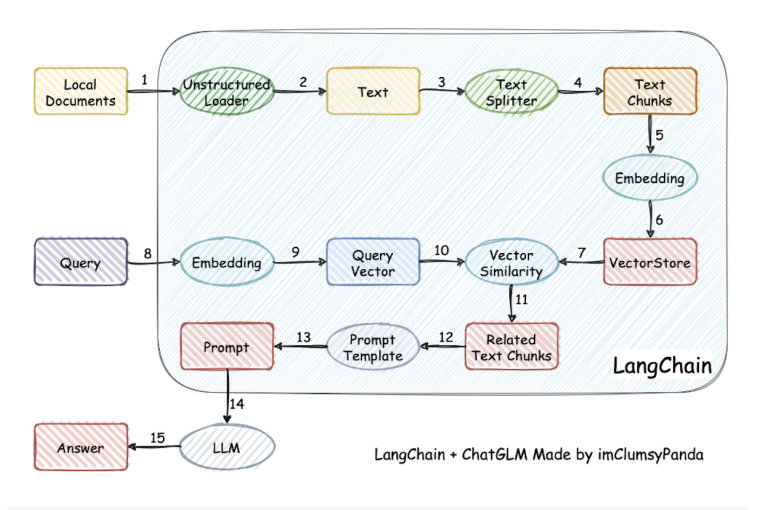
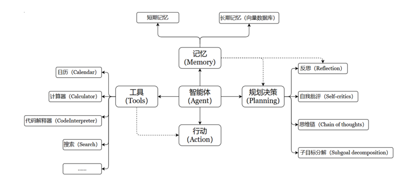

> 本文系统梳理 LangChain 核心组件的使用方法与工作原理，按照 Agent 的工作流程划分为 Prompt Engineering、Memory、Tools、RAG 四个核心模块。

<!-- toc -->

---

## 一、概述

### 1.1 什么是 LangChain
- LangChain 的定位与核心价值
    LangChain 是一个帮助你构建 LLM 应用的 全套工具集 。涉及到prompt 构建、LLM 接入、记忆管理、工具调用、RAG、智能体开发等模块。
- RAG架构开发
    RAG（Retrieval-Augmented Generation），检索增强生成，目的是减少大模型的幻觉，提升回答质量，其流程如图。

    用户提问后，模型会从本地的向量数据库去寻找向量方向相近的内容，然后将内容与用户的问题结合提示词一起交给大模型去生成结果。
- Agent架构开发
    如果只能给出文本，或者说对话的话，终究只是纸上谈兵的llm，而agent就是给其工具，让其能通过工具去完成任务（要区别于强化学习的agent）



### 1.2 LangChain的安装 
推荐使用PyCharm编译器，建议下载专业版，专业版可以远程连接云服务器；如果是新了解python学习的，建议先了解一下Anaconda创建py隔离环境，避免py环境之间的污染
```bash
pip config set global.index-url https://pypi.tuna.tsinghua.edu.cn/simple
#如果不是国内镜像源，请先设置为国内镜像源，如果设置过了可以直接跳过
pip install langchain
#默认安装最新版，目前1.x版本与0.x版本有比较大的变化，也可使用conda install langchain 
```

### 1.3 LangChain的框架
```
#获取api和url的变量

#提示词模板

#上下文记忆

#检索向量数据库（需要先分割文档并建立向量数据库）

#生成内容或任务逻辑

#调用工具完成任务

```

---

## 二、Model I/O
### 2.1 调用模型
模型可以分为非对话模型，对话模型，嵌入模型。调用模型之前要要在环境变量或者配置文件配好申请到的大模型api和url
```python
#LangChain的“hello world”，以qwen模型为例
import os
import dotenv 
from langchain_openai import OpenAI
dotenv.load_dotenv() #可以添加参数 override=True 来清理旧缓存的环境变量
os.environ["DASHSCOPE_API_KEY"]=os.getenv("DASHSCOPE_API_KEY")
os.environ["DASHSCOPE_BASE_URL"]=os.getenv("DASHSCOPE_BASE_URL")
llm = ChatOpenAI(    #在这里调用的是ChatModels，既可以生成AImessage，也可以生成List或PromptValue
    model="qwen-plus",
    api_key=os.getenv("DASHSCOPE_API_KEY"),
    base_url=os.getenv("DASHSCOPE_BASE_URL")
)
response = llm.invoke("你好，你是谁") #invoke输出内容为message型
print(response.context) #content可以只返回模型的回答内容，不加content也可以输出，但是会有换行符等其他内容
```
`ChatOpenAI`的必须参数为`base_url,api_key,model`,其他参数也有：
`temperature`：控制文本的“随机性”，取值范围为0-1，越高越“抽象”，越低越“保守”
`max_tokens`：限制文本生成的最大token数，不过qwen的调用好像不是这个参数

不同的模型调用请参考各官方的操作手册
`invoke()`方法为阻塞式输出，会一次性生成ai回答结果，如果想向ds等模型那样一点一点的生成结果，可以在模型中设置`streaming = True`或者使用`stream()`调用，对于多个`HumanMessage`的请求，可以使用`batch()`进行批量调用

### 2.2 message的类型
`SystemMessage` 为AI的行为规则或背景信息，比如“你是智能助手科塔娜”
`HumanMessage` 表示来自用户的输入
`AIMessage` 一般存储AI回复的内容
```python
messages = [
SystemMessage(content="你是一个擅长人工智能相关学科的专家"),
HumanMessage(content="请解释一下什么是机器学习？")
]
response = chat_model.invoke(messages)
print(response.content)
```
这里可以看到SystemMessage有点类似于提示词的功能
---

### 2.3 PromptTemplate
```python
from langchain_core.prompts import PromptTemplate

prompt_template =PromptTemplate.from_template(
    template="你是一个{role},你的名字叫{name}",   #定义提示词模板的字符串，包含文本与变量占位符
    partial_variables={"role":"美食家"}   #字典格式，提前定义一些变量名
)

prompt = prompt_template.format(name="料理鼠王") #format()方法，给变量赋值，并且返回提示词格式，可以用于调用llm
print(prompt)
```

### 2.4 ChatPromptTemplate
相比于PromptTemplate，ChatPromptTemplate是创建聊天消息列表的提示词模板，更适合处理多角色，多轮次的对话场景
```PYTHON
from langchain_core.prompts import ChatPromptTemplate
chat_prompt_template =ChatPromptTemplate(
    messages=[
        ("system","你是一个{role},你的名字叫{name}"),
        ("human","请你评价一下{food}")
    ],
    input_variables=["role","name","food"],
)
#给模板赋值
prompt = chat_prompt_template.format_prompt(input={"role":"美食家","name":"料理鼠王","food":"麻婆豆腐"})  #使用 format_messages() 方法，返回消息列
表
response = chat_model.invoke(prompt)
print(response)
```

### 2.4 输出解析器 
语言模型返回的内容通常都是字符串的格式（文本格式），但在实际AI应用开发过程中，往往希望model可以返回更直观、更格式化的内容，以确保应用能够顺利进行后续的逻辑处理。此时，LangChain提供的 输出解析器 就派上用场了。
LangChain有许多不同类型的输出解析器：
`StrOutputParser` ：字符串解析器
`JsonOutputParser` ：JSON解析器，确保输出符合特定JSON对象格式
`XMLOutputParser` ：XML解析器，允许以流行的XML格式从LLM获取结果
`CommaSeparatedListOutputParser` ：CSV解析器，模型的输出以逗号分隔，以列表形式返回输出
`DatetimeOutputParser` ：日期时间解析器，可用于将 LLM 输出解析为日期时间格式
`OutputFixingParser` ：输出修复解析器，用于自动修复格式错误的解析器，比如将返回的不符合预期格式的输出，尝试修正为正确的结构化数据（如 JSON）
```python
##使用StrOutputParser()
llm = ChatOpenAI(
    model="qwen-plus",
    api_key=os.getenv("DASHSCOPE_API_KEY"),
    base_url=os.getenv("DASHSCOPE_BASE_URL")
)
response = llm.invoke("请简短介绍什么是3A游戏")

#使用StrOutputParser()
from langchain_core.output_parsers import StrOutputParser
parser = StrOutputParser()
str = parser.invoke(response)
print(type(str))
print(str)

#使用JsonOutputParser()
actor_query = "皮克斯工作室"
prompt = f"""请列出{actor_query}的优秀电影作品，**严格按照JSON格式返回**，格式要求：
{{
    "studio": "皮克斯工作室",
    "excellent_movies": ["玩具总动员", "寻梦环游记", "心灵奇旅", ...]
}}"""
response = llm.invoke(prompt)
from langchain_core.output_parsers import JsonOutputParser
parser = JsonOutputParser()
json_result = parser.parse(response.content)
print(json_result)
```

## 三、Memory（记忆系统）

### 3.1 Memory 的核心概念
- 为什么需要 Memory
正常调用大模型是不会记住上下文的，也就是上一次调用大模型的对话内容下一次调用大模型时，大模型是不会“记得”的。

### 3.2 底层存储类ChatMessageHistory
作为所有记忆组件的底层基础，仅负责纯消息对象的存储 / 管理（直接操作HumanMessage/AIMessage等对象），无任何记忆策略（无裁剪、无摘要、无筛选），也不涉及消息格式化（如转字符串）

### 3.3 基础记忆类
- ConversationBufferMemory
按原始顺序完整存储所有对话历史，无裁剪、无压缩，是最基础的对话记忆组件；可通过memory_key自定义历史变量名，return_messages控制输出格式
```Python
#先要调用大模型，这里省略调用大模型的代码了
from langchain_classic.memory import ConversationBufferMemory
memory = ConversationBufferMemory()

#存储历史信息
memory.save_context(
    inputs={"input":"你好，科塔娜"},
    outputs={"output":"你好，我是人工智能助手科塔娜"}
)
memory.save_context(
    inputs={"input":"你知道科塔娜这个名字的由来吗？"},
    outputs={"output":"科塔娜首次出场于经典科幻射击类游戏《Halo》，是其中主角的人工智能助手的名字，在微软游戏收购《Halo》后，微软为其智能助手的名字设置为了科塔娜"}
)

prompt_template = PromptTemplate.from_template(
    template="""
    你可以与人类对话
    当前对话历史：{history}
    人类问题：{question}
    回复：
    """
)

chain = LLMChain(llm=llm_,prompt=prompt_template,memory=memory)
response = chain.invoke({"question":"你知道《halo》的主角吗？"})
print(response)
response = chain.invoke({"question":"你是谁？"})
print(response)
```
- ConversationBufferWindowMemory
在ConversationBufferMemory基础上增加窗口限制，仅保留最近 k 条对话交互，按对话条数裁剪历史，避免内存 /token 过载。超出k条的对话内容则直接丢失，会错失早期信息。

### 3.4 进阶记忆类
- ConversationBufferWindowMemory
基于Token 数量精准控制记忆容量，设置max_token_limit阈值，超阈值时自动移除最早的消息，保留原始对话内容（无压缩 / 摘要）

- ConversationSummaryMemory
通过大模型自动生成对话摘要，用精简的摘要文本替代原始对话存储，新对话加入时会动态更新摘要（旧摘要 + 新对话→新摘要），大幅压缩历史内容。
```python
from langchain_classic.memory import ConversationSummaryMemory
memory = ConversationSummaryMemory(llm=llm_)
memory.save_context({"input":"你好"},{"output":"怎么了"})
memory.save_context({"input":"你是谁"},{"output":"我是ai助手"})
memory.save_context({"input":"你知道你的生日吗"},{"output":"我没有生日"})

print(memory.load_memory_variables({}))
```
-ConversationSummaryBufferMemory
融合ConversationBufferMemory和ConversationSummaryMemory, 保留最近 N 条原始对话，对超出缓冲区的早期对话生成摘要，平衡最新交互的细节和早期对话的核心信息。
```python
from langchain_classic.memory.summary_buffer import ConversationSummaryBufferMemory
from langchain_core.prompts import MessagesPlaceholder,ChatPromptTemplate
from langchain_classic.chains.llm import LLMChain

prompt = ChatPromptTemplate.from_messages([
    ("system", "你是猫娘。"),
    MessagesPlaceholder(variable_name="chat_history"),
    ("human", "{input}")
])
memory = ConversationSummaryBufferMemory(
    llm=llm,
    max_token_limit=400,
    memory_key="chat_history",
    return_messages=True
)

memory.save_context(inputs={"input":"你好，我是猫咪，你是猫娘"},outputs={"output":"你好，我是智能猫娘AI"})
memory.save_context(inputs={"input":"每一句话结束都要带喵字"},outputs={"output":"好的喵"})
memory.save_context(inputs={"input":"卡拉比丘怎么样了？"},outputs={"output":"卡拉比丘似了喵！"})

chain = LLMChain(
    llm=llm,
    prompt=prompt,
    memory=memory,
)

dialogue = [
    ("你好，你是谁？", None),
    ("我是谁？", None),
]

for user_input, _ in dialogue:
    response = chain.invoke({"input": user_input})
    print(f"用户: {user_input}")
    print(f"客服: {response['text']}\n")

print(memory.load_memory_variables({}))
```

---

## 四、Tools（工具调用）

### 4.1 Tool 基础定义
Tools 用于扩展大语言模型（LLM）的能力，使其能够与外部系统、API 或自定义函数交互，从而完成仅靠文本生成无法实现的任务（如搜索、计算、数据库查询等）。Tools 本质上是封装了特定功能的可调用模块，是Agent、Chain或LLM可以用来与世界互动的接口。

- `@tool` 装饰器
用装饰器快速封装函数为工具，默认用函数名做工具名、文档字符串做描述
```python
#使用@tools定义工具
from langchain_classic.tools import tool

@tool(name_or_callable="add_two_number",description="add two number",return_direct=True)
def add_number(a:int, b:int) -> int:
    """计算两数之和"""
    return a+b


print(f"name={add_number.name}")
```
- `StructuredTool` 
类方法创建工具，配置项更丰富，支持同步 / 异步实现
```py
#StructuredTool的from_fuction()的使用
from langchain_core.tools import StructuredTool

def search_google(query: str):
    return "最后查询的结果"

search01 = StructuredTool.from_function(
    func=search_google,
    name="Search",
    description="查询google搜索引擎并将结果返回",
)
print(f"name={search01.name}")
print(f"args={search01.args}")

search01.invoke({"query":"中美AI的发展现状"})
```


### 4.2 工具调用示例
```py
import json
# 获取大模型
import os
import dotenv
from langchain_community.tools import MoveFileTool
from langchain_core.messages import HumanMessage
from langchain_openai import ChatOpenAI

# 加载环境变量
dotenv.load_dotenv(override=True)
os.environ["DASHSCOPE_API_KEY"] = os.getenv("DASHSCOPE_API_KEY")
os.environ["DASHSCOPE_BASE_URL"] = os.getenv("DASHSCOPE_BASE_URL")

# 初始化大模型（重点：适配DashScope的函数调用格式）
chat_model = ChatOpenAI(
    model="qwen-plus",
    api_key=os.getenv("DASHSCOPE_API_KEY"),
    base_url=os.getenv("DASHSCOPE_BASE_URL"),
    temperature=0.1  # 可选，降低随机性
)

# 获取工具并转换为DashScope兼容的函数格式
tools = [MoveFileTool()]
# 手动构造DashScope要求的函数格式（替代convert_to_openai_tool）
functions = []
for tool in tools:
    # 提取工具的元信息，组装为DashScope要求的格式
    func_schema = {
        "name": tool.name,  # 核心：确保name字段存在且正确
        "description": tool.description,
        "parameters": tool.args,  # 工具的参数定义
        "type": "function"  # DashScope要求的固定字段
    }
    functions.append(func_schema)

# 构造消息（补充函数调用的提示，让模型知道要调用工具）
messages = [
    HumanMessage(content="将当前目录下文件a.txt移动到C:\\Users\\apc\\Desktop")
]

# 调用大模型（关键：用function_call指定调用方式，参数格式适配DashScope）
response = chat_model.invoke(
    input=messages,
    functions=functions,
    function_call={"name": "move_file"}  # 明确指定要调用的函数名，避免模型猜错
)

# 打印响应结果
if "function_call" in response.additional_kwargs:
    tool_name = response.additional_kwargs["function_call"]["name"]
    tool_args = json.loads(response.additional_kwargs["function_call"]["arguments"])
    print(f"调用工具：{tool_name}\n 参数：{tool_args}")

else:
    print(f"模型回复：{response.content}")
```


---

## 五、RAG（检索增强生成）

### 5.1 RAG 
RAG（检索增强生成）是缓解 LLM 幻觉、接入私有 / 实时知识的核心方案，LangChain Retrieval 模块封装了 RAG 全流程，用于构建私有知识库问答。

- 文档加载器 
- 文档拆分器
- 嵌入模型
- 向量存储
- 检索器


---

## 六、Agent 系统

### 6.1 Agent 核心概念
- Agent = LLM + Tools + Memory + Planning
LLM是大预言模型，也仅仅是语言模型，他做不了事情。但agent，他具有大语言模型做决策推断，配备有记忆能够上下文联系，也能调用工具完成任务，也被称之为智能体。
- ReAct 推理模式
原理：思考→行动→观察循环，用自然语言做推理
这里的案例中，给了模型两个工具，但模型自行推理判断只需要使用Search工具即可。
```py
import os
import dotenv
from langchain_core.prompts import ChatPromptTemplate, PromptTemplate
from langchain_experimental.cpal.templates.univariate.query import template
from langchain_openai import ChatOpenAI
from langchain_tavily import TavilySearch
from langchain_core.tools import StructuredTool, Tool
from langchain_classic.agents import AgentType, initialize_agent, create_tool_calling_agent, AgentExecutor, \
    create_react_agent
from langchain_experimental.utilities.python import PythonREPL


#使用react模型
dotenv.load_dotenv()
os.environ['TAVILY_API_KEY'] = os.getenv("TAVILY_API_KEY")

#获取tavily搜索工具的实例
Search = TavilySearch(max_results=5)

#获取工具
Search_tool = Tool(
    func=Search.run,
    name="Search",
    description="用于检索互联网上的信息",
)

python_repl = PythonREPL()
calc_tool = Tool(
    name="Calculate",
    func=python_repl.run,
    description="用于执行数学计算，例如计算百分比变化"
)
#获取大语言模型
os.environ["DASHSCOPE_API_KEY"]=os.getenv("DASHSCOPE_API_KEY")
os.environ["DASHSCOPE_BASE_URL"]=os.getenv("DASHSCOPE_BASE_URL")
# 创建通义千问大模型实例
llm = ChatOpenAI(
    model="qwen-plus",
    api_key=os.getenv("DASHSCOPE_API_KEY"),
    base_url=os.getenv("DASHSCOPE_BASE_URL")
)
#获取提示词模板
chat_prompt = ChatPromptTemplate.from_messages([
    ("system","你是一个智能ai助手，根据用户的提问，必要时调用Search工具，使用互联网检索数据"),
    ("human","{input}"),
    ("system","{agent_scratchpad}")
])

#获取agent的实例
agent = create_tool_calling_agent(
    llm = llm,
    prompt = chat_prompt,
    tools = [Search, calc_tool],
)
#获取AgentExecutor的实例
agent_executor = AgentExecutor(
    agent = agent,
    tools=[Search, calc_tool],
    verbose=True,
)
#通过
result = agent_executor.invoke({"input":"查询今天上海的天气情况"})

print(result)
```
---

## 七、Chains（链式组合）

### 7.1 基础 Chain 类型
Chain：链，用于将多个组件（提示模板、LLM模型、记忆、工具等）连接起来，形成可复用的 工作流 ，完成复杂的任务。Chain 的核心思想是通过组合不同的模块化单元，实现比单一组件更强大的功能。

- `LLMChain` - 基础链
这个链至少包括一个提示词模板（PromptTemplate），一个语言模型（LLM 或聊天模型）。
- `SimpleSequentialChain` - 顺序链
最简单的顺序链，多个链 串联执行 ，每个步骤都有 单一 的输入和输出，一个步骤的输出就是下一个步骤的输入，无需手动映射。
- `SequentialChain` - 多输入输出链
- `RouterChain` - 路由链

### 7.2 LCEL (LangChain Expression Language)
- `|` 管道操作符
- `Runnable` 接口
- 链式组合最佳实践
- 并行执行与批处理

### 7.3 复杂工作流构建
- 条件分支
- 循环与递归
- 错误恢复机制

---

## 八、高级主题

### 8.1 回调与监控
- Callbacks 系统
- LangSmith 集成
- 日志与追踪

### 8.2 配置与部署
- 环境变量管理
- 模型切换策略
- 生产环境注意事项

### 8.3 性能优化
- 批处理 (Batching)
- 缓存策略
- 异步调用

---

## 九、实践案例

### 9.1 案例一：智能客服机器人
- 需求分析
- 架构设计
- 完整代码实现

### 9.2 案例二：知识库问答系统
- RAG Pipeline 搭建
- 多轮对话支持
- 效果评估与迭代

### 9.3 案例三：Multi-Agent 协作系统
- Agent 角色定义
- 任务分配与协作
- 结果汇总

---

## 十、资源

### 10.1 参考资源
- 官方文档
- GitHub 示例
- 社区生态（LangGraph、LangServe 等）

---

## 附录


---

*本文持续更新中，如有错误或补充欢迎指正。*
